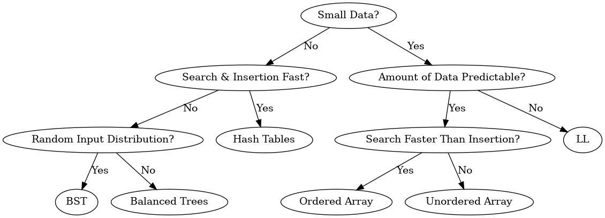
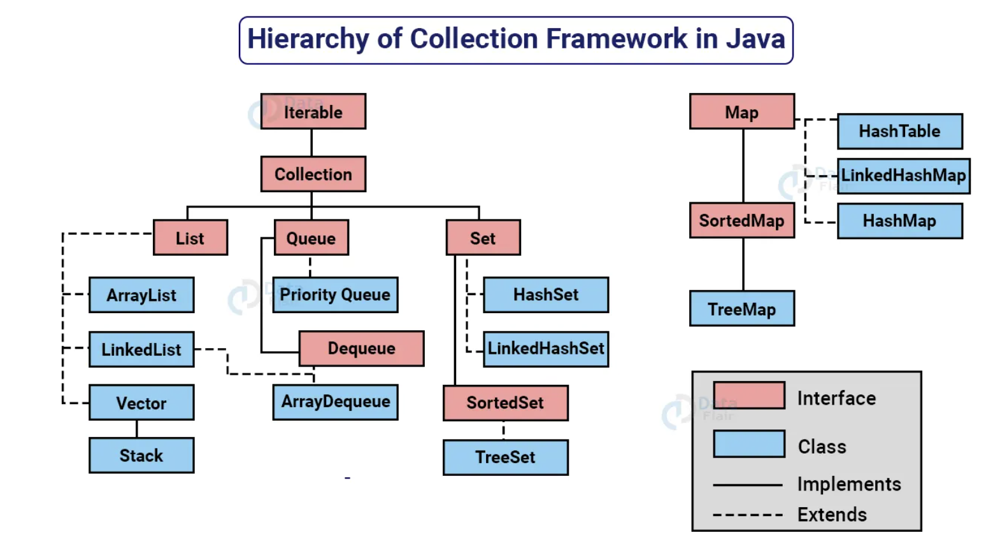

<a name="top"></a>


# 17-683 Data Structures for Application Programmers


## Table of Contents
1. [The Big Picture - When to use what and how much does it cost?](#1-the-big-picture---when-to-use-what-and-how-much-does-it-cost)
    - [Big-O Classifications](#big-o-classifications)

2. [Collections](#2-collections)
    - [Java Collection Hierarchy](#java-collection-hierarchy)

3. [Arrays](#3-arrays)
    - [Arrays Class](#arrays-class)

4. [ArrayList and Binary Search](#4-arraylist-and-binary-search)
    - [Java ArrayList](#java-arraylist)
    - [Amortized Analysis](#amortized-analysis)
    - [Binary Search](#binary-search)

5. [LinkedList](#5-linkedlist)
    - [Java LinkedList Implementation](#java-linkedlist-implementation)
    - [LinkedList Methods](#linkedlist-methods)
    - [Iterator](#iterator)

6. [Stack (LIFO)](#6-stack-lifo)
    - [Stack Implementation using Array](#stack-implementation-using-array)
    - [Stack Methods using Array](#stack-methods-using-array)

7. [Queue (FIFO)](#7-queue-fifo)
    - [Queue Implementation using Array](#queue-implementation-using-array)
    - [Queue Methods using Array](#queue-methods-using-array)

8. [Sorting](#8-sorting)
    - [Bubble Sort](#bubble-sort)
    - [Selection Sort](#selection-sort)
    - [Insertion Sort](#insertion-sort)

9. [Comparable/Comparator](#9-comparablecomparator)
    - [Comparable](#comparable)
    - [Comparator](#comparator)

10. [Recursion](#10-recursion)
    - [Binary Search (Recursive)](#binary-search-recursive)


## 1. The Big Picture - When to use what and how much does it cost?


### Perspective

* **The first priority** as an application programmer is to make the code **work** and **clear** to understand.
* **Performance** is important.
* Focusing too much on **performance** can lead to complicated code that is difficult to understand.

### “Big O” Notation

* Generalized metric for measuring performance

* Definition: $T(n)=O(f(n))$ if and only if there exists constants $c > 0$ and $n_0 > 0$ such that $T(n) \leq c \cdot f(n)$, $\forall n \geq n_0$.


* Characterstics

    - Ignore constants: $1000n = O(n)$

    - Ignore low order terms: $n^3 + n^2 + n = O(n^3)$

### Big-O Classifications

[Time complexity (Big O) cheat sheet](https://leetcode.com/explore/interview/card/cheatsheets/720/resources/4725/)


* $O(1)$: `Constant`
    * An algorithm does NOT depend on the input size.
* $O(log n)$: `Logarithmic`
    * An algorithm gets **slightly slower** as $n$ grows.
* $O(n)$: `Linear`
    * The running time grows as much as $n$ grows (When $n$ doubles, runtime doubles).
* $O(n \cdot log n)$: `Linearithmic`
    * Usually the result of performing $O(log n)$ operation $n$ times or performing $O(n)$ operation $log n$ times.
* $O(n^2)$: `Quadratic`
* $O(2^n)$: `Exponential`
* $O(n!)$: `Factorial`

### Categories of Data Structures

* **General-Purpose Data Structures**
    * Arrays, Linked Lists, Binary Search Trees and Hash Tables.
* **Special-Purpose Data Structures (Abstract Data Types (ADTs))**
    * Stack (LIFO), Queue (FIFO) and Priority Queue
* **Sorting and Searching**
    * Bubble Sort, Selection Sort, Insertion Sort, Quick Sort, Merge Sort, Heap Sort, Linear Search and Binary Search
* **Graphs**

### Flow Chart



[Back to Top](#)


## 2. Collections

### Java Collection Interface
`java.util.Collection`

| Interface | Implementation          |
|-----------|-------------------------|
| List      | ArrayList, LinkedList   |
| Set       | HashSet, TreeSet        |
| Map       | HashMap, TreeMap        |

* **Set** extends Collection but forbids duplicates.
* **List** extends Collection also and allows duplicates and introduces positional indexing.
* **Map** does not extend Collection, but still considered to be part of the Collection Framework.
    * Map is a collection of pairs (key, value).
    * Map cannot contain duplicate keys.

### Java Collection Hierarchy



### General Operations
* Addition (Insertion)
* Removal (Deletion)
* Sorting
* Searching
* Iteration (Traversal)
* Copying (Cloning)


[Back to Top](#)


## 3. Arrays

### Arrays in Java
* Manipulating data: `clone()`
* Immutable field: `length`, once an array is created, its length is fixed and cannot be changed.

---

```Java
int[] a = { 1, 2, 3, 4, 5 };
int[] b = { 1, 2, 3, 4, 5 };
```

Array `a` and `b` are two instances,

- `a == b` checks reference/identity, returns false;

- `a.equals(b)` of Object class also checks reference/identity, returns false.

---

Hexadecimal representation of hashcode of the memory address will be printed

```Java
System.out.println(c); // the same as c.toString()
System.out.println(c.toString());
```

---
Array indexing conventionally begins at 0:
    `Element's memory location = Array's memory location + Element length * Element`


### Arrays Class

`java.util.Arrays`

* Check equality: `Arrays.equals(a, b)`

* Printing values: `System.out.print(Arrays.toString(c));`

* Sorting: `Arrays.sort(c);`

* Copying

    1. `Arrays.copyOf(sA, length);`

        ```Java
        int[] d = Arrays.copyOf(a, 2);
        // d = [1, 2]

        int[] d = Arrays.copyOf(a, 10);
        // d = [1, 2, 3, 4, 5, 0, 0, 0, 0, 0]
        ```

    2. `System.arraycopy(sA, sI, dA, dI, length);`

        ```Java
        int[] e = new int[5];
        System.arraycopy(a, 0, e, 0, 3);
        // e = [1, 2, 3, 0, 0]
        ```

    3. `clone()`

        ```Java
        int[] g = {1, 2, 3, 4, 5};
        int[] h = g.clone();
        ```

    * The above three ways of copying perform **Shallow Copy/Cloning**, which means it creates a new instance and copies all the fields of the object to that new instance where both are referencing to the same memory in heap memory.
        * Arrays of **primitive data types**: copies the value;
        * Arrays of **objects** or **references**: copies the reference of every single object; modifying a object affects other arrays
            * Write code to perform **Deep Copy**


### Resizing an Array

```Java
// Removes item at specified index and returns a new array;
// If not within bounds, return the same array
public static char[] delete(char[] data, int index) {
    if (index >= 0 && index < data.length) {
        char[] tmp = new char[data.length - 1];
        System.arraycopy(data, 0, tmp, 0, index);
        System.arraycopy(data, index + 1, tmp, index, data.length - index - 1);
        return tmp;
    }
    return data;
}
```


[Back to Top](#)


## 4. ArrayList and Binary Search

`java.util.ArrayList`

### ArrayList Methods
* `add(object)`: adds a new element to the end.
* `add(index, object)`: inserts a new element at the specified index.
* `set(index, object)`: replaces an existing element at the specified index with the new element.
* `get(index)`: returns the element at the specified index.
* `remove(index)`: deletes the element at the specified index.
* `size()`: returns the number of elements.

### Java ArrayList
* Whenever an instance of ArrayList in Java is created then **by default** the capacity of Arraylist is `10`.

* **Expand** when `add()` is called, but **DOES NOT shrink** when `delete()`.

    ```Java
    // Initialize an arraylist with initial length of 0
    List<Integer> numbers = new ArrayList<Integer>(0);

    // Add numbers
    for (int i = 0; i < 10; i++) numbers.add(i);
    System.out.println(numbers);

    // Delete numbers
    for (int i = numbers.size() – 1; i >= 0; i--) {
        if (numbers.get(i) % 2 == 0) numbers.remove(i);
    }
    System.out.println(numbers);
    ```

    * If there is issue with unused memory, manually invoke `trimToSize()` method to free up the memory by shrinking size to the number of elements.

* ArrayList used to implement the **doubling-up policy**; In Java 6, there has been a change to be $(oldCapacity * 3) / 2 + 1$.
    * For corner cases where $oldCapacity = 0$ or $oldCapacity = 1$, we must $+ 1$ to expand the array


### Amortized Analysis

`List<Integer> numbers = new ArrayList<Integer>(4);`

| Running time | # of elements | Array length | Allocated dollars | Cost | Saved dollars | Balance |
|--------------|---------------|--------------|-------------------|------|---------------|---------|
| 1            | 1             | 4            | 3                 | 1    | 2             | 2       |
| 1            | 2             | 4            | 3                 | 1    | 2             | 4       |
| 1            | 3             | 4            | 3                 | 1    | 2             | 6       |
| 1            | 4             | 4            | 3                 | 1    | 2             | 8       |
| 5            | 5             | 8            | 3                 | 5    |-2             | 6       |
| 1            | 6             | 8            | 3                 | 1    | 2             | 10      |
| 1            | 7             | 8            | 3                 | 1    | 2             | 12      |
| 1            | 8             | 8            | 3                 | 1    | 2             | 12      |
| 9            | 9             | 16           | 3                 | 9    |-6             | 6       |

* `add(E e)` method has **amortized constant time**
* Latency Issue  
    


### Binary Search
* Prerequisite: **The array should be ordered**.

```Java
public static int binarySearch(int[] data, int key) {
    int l = 0;
    int r = data.length - 1;
    int mid;

    while (true) {
        if (l > r) {
            return -1;
        }
        mid = (l + r)/2; // Overflow issue
        if (data[mid] == key) {
            return mid;
        }
        if (data[mid] < key) {
            l = mid + 1;
        } else {
            r = mid - 1;
        }
    }
}
```

#### One's Complement
* The **ones' complement** of a binary number is the value obtained by **inverting (flipping) all the bits** in the binary representation of the number.

#### Two's Complement
* The **most significant bit (MSB)**, i.e. the number on the left, is known as the sign bit, which is used to represent whether the number is positive (0) or negative (1).
* The **twos' complement**, which is the negative equivalent of the original binary number, is get by **taking ones' complement** and **adding 1**.

| Bits | Unsigned value | Signed value (Two's complement) | One's Complement | Two's Complement |
|------|----------------|---------------------------------|------------------|------------------|
| 000  | 0              | 0                               | 111              | 000              |
| 001  | 1              | 1                               | 110              | 111              |
| 010  | 2              | 2                               | 101              | 110              |
| 011  | 3              | 3                               | 100              | 101              |
| 100  | 4              | -4                              | 011              | 100              |
| 101  | 5              | -3                              | 010              | 011              |
| 110  | 6              | -2                              | 001              | 010              |
| 111  | 7              | -1                              | 000              | 001              |

* With $n$ bits, we can represent unsigned numbers $0$ to $2^{(n-1)}$.
* With $n$ bits, we can represent signed numbers $–2^{(n-1)}$ to $2^{(n-1)}–1$.
* Therefore, use `mid = l + (r - l)/2` instead of `mid = (l + r)/2` in Binary Search to avoid potential integer overflow issues.


#### Time Complexity of Binary Search

`O(log n)`

* In general, it takes $\lfloor \log_{2} n \rfloor+ 1$ times to split an array in half before it becomes empty.

* $c * \log_{10}(x) = \log_2(x)$ where $c = \frac{\log (10)}{\log (2)} = 3.3219$

* The time complexity of an algorithm with `O(log n)` does not grow proportionally with the input size $n$ but only increases by a constant factor.
    $$
    \begin{align*}
    c \cdot \log_2(2 * n) & = c \cdot (\log_2 2 + \log_2 n) \\
    & = c + c \cdot \log_2 n
    \end{align*}
    $$


### Big O Caveat
When analyzing algorithms using Big O notation, it is essential to consider constants because Big O notation represents an upper bound on the growth rate of an algorithm's complexity.

Consider:
    $$
    \begin{align*}
    T(n) &= n \log n\\
    U(n) &= 50 n
    \end{align*}
    $$

* $n \text{ is small} \Rightarrow T(n) \text{ might be slower than } U(n)$  
* $n \text{ is large} \Rightarrow T(n) \text{ grows more slowly than } U(n)$  


### Array/AL Summary
1. Random access
2. No holes allowed -> Shifts
3. Immutable length -> Memory, latency issue


[Back to Top](#)


## 5. LinkedList

### Java LinkedList
* `addFirst(element: Object)`: void
* `addLast(element: Object)`: void
* `getFirst()`: Object
* `getLast()`: Object
* `removeFirst()`: Object
* `removeLast()`: Object

### Types
1. Singly Linked List
2. Doubly Linked List
3. Circular Linked List

### Java LinkedList Implementation

```Java
public class LinkedList<AnyType> {
    private Node<AnyType> head;

    // Constructs an empty list
    public LinkedList() {
        head = null;
    }


    // TODO: implement all the methods below.
    ...


    // Static inner class
    private static class Node<AnyType> {
        private AnyType data;
        private Node<AnyType> next;

        // Constructor with data and next node
        Node(AnyType d, Node<AnyType> n) {
            data = d;
            next = n;
        }
    }

}
```

* Types of nested (inner) classes
    * **Static**: do not have access to the instance variables and methods of the outer class directly.
    * **Non-static**:  have access to the instance variables and methods of the outer class.


### LinkedList Methods

#### addFirst

```Java
// Inserts a new item at the beginning of the list
public void addFirst(AnyType item) {
    head = new Node<AnyType>(item, head);
}
```

#### Traverse to the last node

```Java
Node<AnyType> tmp = head;
while (tmp.next != null) { // Stop at the last node
    tmp = tmp.next;
}
```

#### addLast

```Java
/**
 * Inserts a new item to the end of the list.
 */
public void addLast(AnyType item) {
    // If the list is empty, insert head
    if (head == null) {
        //head = new Node<AnyType>(item, null);
        addFirst(item);
        return;
    }
    
    // Traverse to the last element
    Node<AnyType> tmp = head;
    while (tmp.next != null) {
        tmp = tmp.next;
    }
    
    // Insert to the end of the list
    tmp.next = new Node<AnyType>(item, null);
}

```

#### insertAfter

```Java
/**
 * Finds a node containing the key and inserts a new item after the node.
 */
public void insertAfter(AnyType key, AnyType item) {
    Node<AnyType> tmp = head;

    // Find the location with the given key
    while (tmp != null && !tmp.data.equals(key)) {
        tmp = tmp.next;
    }
    
    // If the key is found
    if (tmp != null) {
        // Insert after the node
        Node<AnyType> newNode = new Node<AnyType>(item, tmp.next);
        tmp.next = newNode;
    }
}
```


#### insertBefore

```Java
/**
 * Finds a node containing the key and inserts a new item before the node.
 * @param key, a key to be found to add a new element
 * @param item, a data to be added into the list
 */
public void insertBefore(AnyType key, AnyType item) {
    // If the list is empty
    if (head == null) {
        return;
    }
    
    // If head has the key
    if (head.data.equals(key)) {
        //head = new Node<AnyType>(item, head);
        addFirst(item);
        return;
    }
    
    /*
     * If key is not in the head;
     * Needs to keep track of previous node of current node
     */
    Node<AnyType> prev = null;
    Node<AnyType> cur = head;
    while (cur != null && !cur.data.equals(key)) {
        prev = cur;
        cur = cur.next;
    }
    
    // Found it, add new node before the current node
    if (cur != null) {
        prev.next = new Node<AnyType>(item, cur);
    }
}

```


#### remove

```Java
/**
 * Removes the first occurrence of a key from the list.
 * @param key, a key to be deleted
 */
public void remove(AnyType key) {
    // If the list is empty
    if (head == null) {
        return;
    }
    
    // If head has the key
    if (head.data.equals(key)) {
        head = head.next;
        return;
    }
    
    /*
     * If key is not in the head;
     * Needs to keep track of previous node of current node
     */
    Node<AnyType> prev = null;
    Node<AnyType> cur = head;
    while (cur != null && !cur.data.equals(key)) {
        prev = cur;
        cur = cur.next;
    }
    
    // If current node has the key
    if (cur != null) {
        prev.next = cur.next;
    }
}

```

### Time Complexities
* addFirst: `O(1)`
* insertBefore/insertAfter: `O(n)`
* remove: `O(n)`
* search: `O(n)`


### Iterator

Modifications to the LinkedList class:

```Java
import java.util.*;

public class LinkedList<AnyType> implements Iterable<AnyType> {
    private Node<AnyType> head;

    // Constructs an empty list
    public LinkedList() {
        head = null;
    }


    ...


    /**
     * Iterator implementation that returns iterator object.
     */
    @Override
    public Iterator<AnyType> iterator() {
        return new LinkedListIterator<>();
    }

    /**
     * (Non-static) inner class for LinkedListIterator that implements Iterator interface.
     */
    private class LinkedListIterator implements Iterator<AnyType> {
        private Node<AnyType> nextNode;

        LinkedListIterator() {
            nextNode = head;
        }

        @Override
        public boolean hasNext() {
            return nextNode != null;
        }

        @Override
        public AnyType next() {
            // When there is no next element
            if (!hasNext()) {
                throw new NoSuchElementException();
            }

            AnyType tmp = nextNode.data;
            nextNode = nextNode.next;
            return tmp;
        }
    }
}
```


### ArrayList v.s. LinkedList
* ArrayList:
    - Locate element: `O(1)`
    - Perform insertion/deletion: `O(n)`  

* LinkedList
    - Locate element: `O(n)`
    - Perform insertion/deletion: `O(1)`  


[Back to Top](#)


## 6. Stack (LIFO)

### Conceptual View
* A web browser's back button can be implemented using a stack data structure because it mirrors the behavior of a stack in terms of the order of visited pages. When a user visits a webpage, the URL of that page is pushed onto the stack. When a user clicks the back button in the browser, it pops the top URL from the stack.

* Operations
    - push(), push an item onto the top of the stack
    - pop(), pop the item from the top of the stack


### Stack Interface
```Java
public interface StackInterface<AnyType> {
    void push(AnyType item); // O(1)
    AnyType pop(); // O(1)
    AnyType peek(); // O(1)
    boolean isEmpty(); // O(1)
}
```
The above abstract methods in the interface are already `public` `abstract` so there is no need to include the keywords.


### Stack Implementation using Array

```Java
public class ArrayStack<AnyType> implements StackInterface<AnyType> {
    private static final int DEFAULT_CAPACITY = 10; // Constant
    private int top;
    private Object[] elements;

    public ArrayStack(int initialCapacity) {
        if (initialCapacity <= 0) {
            elements = new Object[DEFAULT_CAPACITY];
        } else {
            elements = new Object[initialCapacity];
        }
        // Set the top to be -1, indicating the stack is empty
        top = -1;
    }

    public ArrayStack() {
        this(DEFAULT_CAPACITY); // Calls the constructor with default capacity
    }

    // TODO: implement all the methods here
    ...
}
```


### Stack Methods using Array


#### isEmpty

```Java
/**
 * Checks if the stack is empty in O(1).
 * @return true if it is empty, false otherwise
 */
@Override
public boolean isEmpty() {
    return top == -1;
}
```


#### Push

```Java
/**
 * Pushes a new item onto the top of the stack in O(1).
 * @param item, a new item to add
 * @throws StackException if stack is full
 */
@Override
public void push(AnyType item) {
    if (top == (elements.length - 1)) {
        throw new StackException("Stack is full");
    }
    top = top + 1;
    elements[top] = item;
}
```


#### Pop
```Java
/**
 * Gets and removes the top item in O(1).
 * @return top, item on the top
 * @throws StackException indicating the stack is empty
 */
@Override
public AnyType pop() {
    if (isEmpty()) {
        throw new StackException("Stack is empty");
    }
    @SuppressWarnings("unchecked")
    AnyType item = (AnyType) elements[top];
    elements[top] = null;
    top = top - 1;
    return item;
}
```


- **Casting Up**: casting an object to a *superclass* or *interface* type
    - **No type check is needed** since every instance of the subclass is also an instance of its superclass
- **Casting Down**: casting an object to a *subclass* type
    - **May throw a ClassCastException** at runtime if the object being cast is not actually an instance of the subclass
    - `@SuppressWarnings("unchecked")` annotation is often used when casting down to suppress the compiler warning about unchecked casts


#### Peek
```Java
/**
 * Gets (peeks) the top element but does not delete it in O(1).
 * @return top, item on the top
 * @throws StackException indicating the stack is empty
 */
@SuppressWarnings("unchecked")
@Override
public AnyType peek() {
    if (isEmpty()) {
        throw new StackException("Stack is empty");
    }
    return (AnyType) elements[top];
}
```


### Stack using LinkedList Methods

Treating the first element of the linked list as the top of the stack
```Java
LinkedList<Integer> theStack = new LinkedList<Integer>();

// Push onto the stack
theStack.addFirst(0);

// Pop from the stack
theStack.removeFirst();
```

Also, `addLast()`/`removeLast()` methods can be used to implement a stack that treats the last element of the linked list as the top of the stack.


### Stack Usage: Reverse a String

```Java
/**
 * Simple Application to reverse a String using Stack.
 */
public class Reverser {
    /**
     * Input string.
     */
    private String input;

    /**
     * Constructor with a specific input string.
     * @param str string to reverse
     */
    public Reverser(String str) {
        input = str;
    }

    /**
     * Performs reversal operation and returns a new string.
     * @return reversed string
     */
    public String doReverse() {
        ArrayStack<Character> stack = new ArrayStack<Character>(input.length());
        for (int i = 0; i < input.length(); i++) {
            stack.push(input.charAt(i));
        }

        StringBuilder sb = new StringBuilder();
        while (!stack.isEmpty()) {
            sb.append(stack.pop());
        }
        return sb.toString();
    }
}
```


[Back to Top](#)


## 7. Queue (FIFO)


### Conceptual View
- Methods
    - **Enqueue**: inserting a new item to the back of the queue
    - **Dequeue**: removing the first item from the queue


### Queue Interface

```Java
public interface QueueInterface<AnyType> {
    void enqueue(AnyType item);  // O(1)
    AnyType dequeue(); // O(1)
    AnyType peekFront(); // O(1)
    boolean isEmpty(); // O(1)
}
```


### Queue Implementation using Array

```Java
public class ArrayQueue<AnyType> implements QueueInterface<AnyType> {
    private static final int DEFAULT_CAPACITY = 6; // Constant
    private Object[] elements; 
    private int front; // The front index
    private int back; // The back index
    private int nItems; // Keeps track of current number of items

    public ArrayQueue() {
        elements = new Object[DEFAULT_CAPACITY]; 
        front = 0;
        back = 0; // or back = -1; depending on the implementation
        nItems = 0;
    }

    // TODO: implement all of the core methods here
    ...
}
```


### Queue Methods using Array

#### isEmpty

```Java
/**
 * Checks if the queue is empty or not in O(1).
 * @return true if the queue is empty, false if not
 */
@Override
public boolean isEmpty() {
    return nItems == 0;
}
```

#### isFull

```Java
/**
 * Private helper method to check if queue is full or not.
 * @return true if it is full and false if not
 */
private boolean isFull() {
    return nItems == elements.length;
}
```

#### enqueue

```Java
/**
 * Enqueues a new item to the end of the queue in O(1).
 * @param item, a new item to add
 * @throws RuntimeException indicating the queue is full
 */
@Override
public void enqueue(AnyType item) {
    if (isFull()) {
        throw new RuntimeException("Queue is full");
    }

    back++;

    int index = back % elements.length;
    elements[index] = item;

    nItems++;
}
```

#### dequeue

```Java
/**
 * Gets and deletes an item from the front of the queue in O(1).
 * @return item, the first item in the queue
 * @throws NoSuchElementException indicating the queue is empty
 */
@Override
public AnyType dequeue() {
    if (isEmpty()) {
        throw new NoSuchElementException();
    }

    int index = front % elements.length;

    @SuppressWarnings("unchecked")
    AnyType item = (AnyType) elements[index];
    elements[index] = null; // Deletes the item

    front++;
    nItems--;

    return item;
}
```

#### peekFront

```Java
/**
 * Gets an item from the front of the queue but does not delete it in O(1).
 * @return the first item in the queue
 * @throws NoSuchElementException indicating the queue is empty
 */
@SuppressWarnings("unchecked")
@Override
public AnyType peekFront() {
    if (isEmpty()) {
        throw new NoSuchElementException();
    }
    return (AnyType) elements[front % elements.length];
}
```


### Queue using LinkedList Methods

```Java
LinkedList<Integer> theQueue = new LinkedList<Integer>();

// Enqueue into the queue
theQueue.addLast(5);

// Dequeue from the queue
theQueue.removeFirst();
```


[Back to Top](#)


## 8. Sorting

```Java
/**
 * A helper method that swaps two values in an integer array.
 */
private static void swap(int[] data, int one, int two) {
    int temp = data[one];
    data[one] = data[two];
    data[two] = temp;
}
```

### Bubble Sort

```Java
/**
 * Bubble sort, O(n^2) in the worst-case.
 * Focus on the largest value!
 * Simple but slow.
 * @param data, an array of int to sort
 */
public static void bubbleSort(int[] data) {
    for (int out = data.length - 1; out >= 1; out--) { // The remaining element is the smallest
        for (int in = 0; in < out; in++) { // The largest elements are bubbled up to the end, no need to check
            if (data[in] > data[in + 1]) {
                swap(data, in, in + 1);
            }
        }
    }
}
```

* Total comparisons:
    $$ \frac{(n-1)n}{2} $$

* Total swaps:
    $$ \frac{(n-1)n}{4} $$
    - Arithmetic series formula
    - Binomial coefficient:
        $$ {n \choose k} = \frac{n!}{k!(n-k)!} $$


### Selection Sort

```Java
/**
 * Selection sort, O(n^2).
 * Focus on the smallest value!
 * Faster than bubble sort mainly due to less number of swaps.
 * @param data, an array of int to sort
 */
public static void selectionSort(int[] data) {
    int min;
    for (int out = 0; out < data.length - 1; out++) {
        min = out;
        for (int in = out + 1; in < data.length; in++) {
            if (data[in] < data[min]) {
                min = in;
            }
        }
        // Swap the min value with out index's value
        if (out != min) {
            swap(data, out, min);
        }
    }
}
```

* Less number of swaps


### Insertion Sort

```Java
/**
 * Insertion sort, O(n^2) in the worst case.
 * Best case runntime complexity is O(n).
 * 
 * Sensitive to the input values.
 * Less number of comparisons on average.
 * Uses shifting (copying) instead of swapping (one swap equals to three copies).
 * @param data, an array of int to sort
 */
public static void insertionSort(int[] data) {

    for (int out = 1; out < data.length; out++) {
        int tmp = data[out];
        int in = out;
        /**
         * Loop backward through the sorted section but not necessarily to 0-th
         * On average, go halfway through the sorted section
         */
        while (in > 0 && data[in - 1] >= tmp) {
            data[in] = data[in - 1]; // Shift to right
            in--;
        }

        // INSERT the tmp value into the right position of the sorted section
        if (out != in) {
            data[in] = tmp;
        }
    }
}
```

* Total comparisons:
    $$ \frac{n(n-1)}{4} $$


[Back to Top](#)


## 9. Comparable/Comparator

### Comparable

* Implement Comparable interface and override `compareTo()`, the default way to compare

* `compareTo()` is used to implement the **natural/default ordering** of the class

* Note that the class's `compareTo()` should be consistent to `equals()` and `hashCode()` such that:
    - If `x.equals(y)` is true, then `x.compareTo(y)` must equal to 0
    - If `x.equals(y)` is true, then `x.hashCode()` must equal to `y.hashCode()`


```Java
public class Card implements Comparable<Card> {
    private String suit;
    private int rank;

    /**
     * Constructs a card with suit and rank.
     * @param suit suit of a card
     * @param rank rank of a card
     */
    public Card(String s, int r) {
        suit = s;
        rank = r;
    }

    /**
     * Returns suit of a card.
     * @return suit
     */
    public String getSuit() {
        return suit;
    }

    /**
     * Returns rank of a card.
     * @return rank
     */
    public int getRank() {
        return rank;
    }

    /**
     * Returns String representation of card objects.
     * @return String representation of card objects
     */
    @Override
    public String toString() {
        return suit + ", " + rank;
    }

    /**
     * Uses rank to compare cards
     * @return positive, 0 or negative
     */
    @Override
    public int compareTo(Card other) {
        return Integer.compare(rank, other.rank);
    }


    /******************************************************************************
     *
     * Example of compareTo, equals and hashCode methods using Apache Commons Lang
     *
     ******************************************************************************/

    @Override
    public int compareTo(Card other) {
        return new CompareToBuilder()
                .append(this.suit, other.suit)
                .append(this.rank, other.rank)
                .toComparison();
    }

    @Override
    public boolean equals(Object other) {
        if (!(other instanceof Card)) {
            return false;
        }
        Card castOther = (Card) other;
        return new EqualsBuilder()
                .append(this.suit, castOther.suit)
                .append(this.rank, castOther.rank)
                .isEquals();
    }

    @Override
    public int hashCode() {
        return new HashCodeBuilder().append(this.suit).append(this.rank).toHashCode();
    }
    

    /************************************************************************
     *
     *  Example of compareTo, equals and hashCode methods using Google Guava
     *
     *  Note: When using Java 7 or later version, you can use Objects class
     *  in java.util instead of using Guava
     *
     ************************************************************************/

    @Override
    public int compareTo(Card other) {
        return ComparisonChain.start()
                .compare(this.suit, other.suit)
                .compare(this.rank, other.rank)
                .result();
    }

    @Override
    public boolean equals(Object obj){
        if(!(obj instanceof Card)){
            return false;
        }
        Card other = (Card) obj;
        return Objects.equal(this.suit, other.suit)
                && Objects.equal(this.rank, other.rank);
    }

    @Override
    public int hashCode(){
        return Objects.hashCode(this.suit, this.rank);
    }
    
}
```


### Comparator

* Implement Comparator interface and override `compare()`

* `compare()` allows for defining multiple **custom/alternative orderings** for a class


```Java
public class CompareBySuit implements Comparator<Card> {
    /**
     * Implementation of compare method by suit.
     * @return positive, 0 or negative
     */
    @Override
    public int compare(Card x, Card y) {
        return x.getSuit().compareToIgnoreCase(y.getSuit());
    }
}
```


```Java
public class CompareBySuitRank implements Comparator<Card> {
    /**
     * Implementation of compare method using both suit and rank.
     * @return positive, 0, or negative
     */
    @Override
    public int compare(Card x, Card y) {
        int suitResult = x.getSuit().compareToIgnoreCase(y.getSuit());
        if (suitResult != 0) {
            return suitResult;
        }
        return Integer.compare(x.getRank(), y.getRank());
    }

}
```


### Collections.sort

```Java
// Default: uses compareTo method implemented
Collections.sort(cards);

// Uses compare method implemented in Comparator class
Collections.sort(cards, new CompareBySuit());
Collections.sort(cards, new CompareBySuitRank());
```


[Back to Top](#)


## 10. Recursion


### Characteristics
Recursion is characterized by the following features:

1. **Self-referential Functionality:** A recursive function is distinguished by its ability to call itself, enabling the function to operate on smaller subsets of the problem.

2. **Base Case:** This acts as a termination criterion, preventing infinite recursion and ensuring that each recursive call progresses toward this condition.

3. **Bookkeeping Overhead:** Recursive calls involve considerable management of function states and return addresses, which can lead to increased memory usage.


### Iterative/Recursive Comparison
```Java
/**
 * Sums from 1 to n iteratively.
 * @param n, positive integer
 * @return sum from 1 to n
 */
public static int sum(int n) {
    int result = 0;
    for (int i = 1; i <= n; i++) {
        result = result + i;
    }
    return result;
}
```


```Java
/**
 * Sums from 1 to n recursively.
 *
 * recSum(5)                               15
 *    5+recSum(4)                     10+5=15
 *      4+recSum(3)               6+4=10
 *        3+recSum(2)         3+3=6
 *          2+recSum(1) = 1+2=3
 * @param n
 * @return sum from 1 to n
 */
public static int recSum(int n) {
    if (n == 1) {
        return n;               // base case
    }
    return n + recSum(n - 1); // recursive case
}
```


### Fibonacci Numbers

```Java
/**
 * Finds n-th fibonacci number.
 * @param n, positive value or 0
 * @return n-th fibonacci number
 */
public static long fib(int n) {
    if (n == 0 || n == 1) {
        return n;
    }
    return fib(n - 1) + fib(n - 2);
}
```

Below is the recursion tree for `fib(6)`:


### Binary Search (Recursive)

```Java
/**
 * Binary search in a non-null array.
 * @param data, int array to search against (ordered in ascending order)
 * @param key, int key value to search for
 * @return index if found, -1 if not found
 */
public static int find(int[] data, int key) {
    return find(data, key, 0, data.length - 1);
}
```

```Java
/**
 * Private helper method for binary search that uses recursion.
 * @param data, int array to search against (ordered in ascending order)
 * @param key, int key value to search for
 * @param lowerBound, lower bound index of the array
 * @param upperBound, upper bound index of the array
 * @return index if found, -1 if not found
 */
private static int find(int[] data, int key, int lowerBound, int upperBound) {
    // Base case 1: not found
    if (lowerBound > upperBound) {
        return -1;
    }

    int mid = lowerBound + (upperBound - lowerBound) / 2;

    // Base case 2: found
    if (data[mid] == key) {
        return mid;
    }

    // Recursive cases
    if (data[mid] < key) {
        return find(data, key, mid + 1, upperBound);
    }
    return find(data, key, lowerBound, mid - 1);
}
```


[Back to Top](#)
