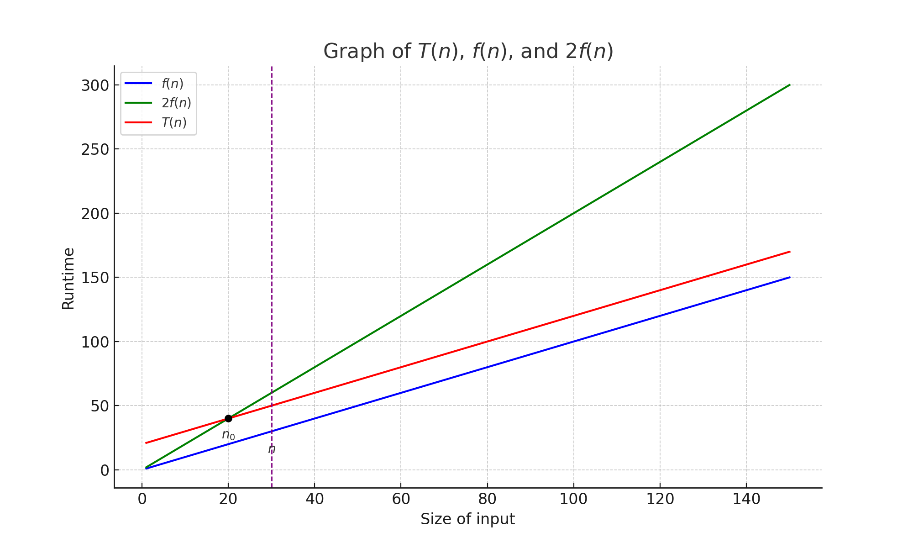

# 1. The Big Picture

## Perspectives
- Primary goal for programmers is to create code that is functional and easy to understand.
- While ensuring good performance is important, it is crucial not to over-prioritize it.
- Overemphasizing performance can result in unnecessarily complex code, making it hard to manage.

## Big-O Notation
- Big-O notation is a *generalized* metric used to describe the upper bound of an algorithm's runtime or space complexity, expressing how an algorithm's performance scales as input size increases.

- Definition

$$
f(n) = O(g(n)) \text{ if there exist constants } c > 0 \text{ and } n_0 > 0 \text{ such that } 0 \leq f(n) \leq c \cdot g(n) \text{ for all } n \geq n_0.
$$

<!--  -->

- Characterstics
    - Constants are ignored: $$ 1000n = O(n) $$
    - Low-order terms are ignored: $$ n^3 + n^2 + n = O(n^3) $$

## Big-O Classifications

<!--  -->

  

  - $O(1)$: **Constant**
    - The algorithm does NOT depend on the input size.
  - $O(\log n)$: **Logarithmic**
    - The algorithm gets slightly slower as $n$ grows.
  - $O(n)$: **Linear**
    - The runtime grows as much as $n$ grows (When $n$ doubles, runtime doubles).
  - $O(n \cdot \log n)$: **Linearithmic**
    - Usually the result of performing $O(\log n)$ operation $n$ times or performing $O(n)$ operation $log n$ times.
  - $O(n^2)$: **Quadratic**
  - $O(2^n)$: **Exponential**
  - $O(n!)$: **Factorial**

  

## Data Structures

- **General-Purpose Data Structures**
    - Arrays
    - Linked Lists
    - Hash Tables
    - Binary Search Trees

- **Special-Purpose Data Structures (Abstract Data Types (ADTs))**
    - Stack (LIFO)
    - Queue (FIFO)
    - Priority Queues

- **Sorting and Searching**
    - Linear Search and Binary Search
    - Bubble Sort
    - Selection Sort
    - Insertion Sort
    - Quick Sort
    - Merge Sort
    - Heap Sort

- **Graphs**

## Relationship of General-Purpose Data Structures

---

[Back to Home](../index.html)
[Next Lecture](./lecture2.html)