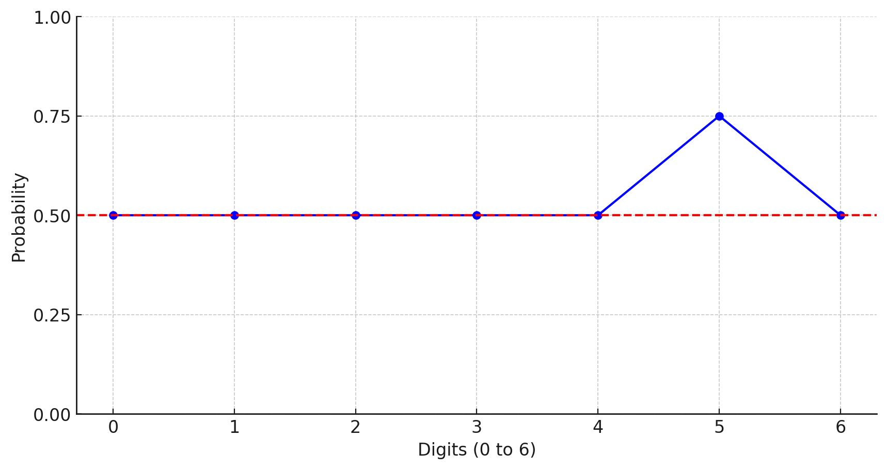

<style TYPE="text/css">
code.has-jax {font: inherit; font-size: 100%; background: inherit; border: inherit;}
</style>
<script type="text/x-mathjax-config">
MathJax.Hub.Config({
    tex2jax: {
        inlineMath: [['$','$'], ['\\(','\\)']],
        skipTags: ['script', 'noscript', 'style', 'textarea', 'pre'] // removed 'code' entry
    }
});
MathJax.Hub.Queue(function() {
    var all = MathJax.Hub.getAllJax(), i;
    for(i = 0; i < all.length; i += 1) {
        all[i].SourceElement().parentNode.className += ' has-jax';
    }
});
</script>
<script type="text/javascript" src="https://cdnjs.cloudflare.com/ajax/libs/mathjax/2.7.4/MathJax.js?config=TeX-AMS_HTML-full"></script>


# 13. Hashing, HashMap and HashSet

## Java HashCode

```Java
Integer itr = Integer.valueOf(17683);
itr.hashCode();
// Output: 17683

String str = new String("17683");
str.hashCode();
// Output: s.charAt(0) * 31^(n-1) + s.charAt(1) * 31^(n-2) + ... + s.charAt(n-1)
```

- Previously: `cats` is $3*27^3 + 1*27^2 + 20*27^1 + 19*27^0$
- In Javadoc: `cats` is $99*31^3 + 97*31^2 + 116*31^1 + 115*31^0$


## Why Base 31?

### ASCII Codes

A-Z (65-90), a-z (97-122)

- The fifth bit indicates **lowercase**
    - The uppercase `B` (ASCII 66) is `01000010` in binary.
    - The lowercase `b` (ASCII 98) is `01100010` in binary.

- In the English articles, there are more lowercase letters than uppercase letters

    


### Comparison with Base 32

### Base 32

- `ab` is $97 * 32 + 98$
- Since $32 = 2^5$, perform `97 * 32 + 98` = `97 << 5 + 98`
    - Prbability of fifth bit is not spreaded:

        ```
        110000100000      --> 97 << 5
        +    1100010      --> 98
             △△
        ------------
        110010000010
        ```

#### Base 31

- `ab` is $97 * 31 + 98$

- Since $32 = 2^5$, perform `97 * 31 + 98` = `97 << 5 - 97 + 98`

    - Spreading out the bits:

        ```
            110000100000  --> 97 << 5
        -        1100001  --> 97
             △
        ----------------
            101110111111
        +        1100010  --> 98
        ----------------
            110000100001
        ```


## hash() and indexFor()

In Java 7's HashMap:

```Java
int hash = hash(key.hashCode());
int i = indexFor(hash, table.length);
```


### indexFor()

```Java
static int indexFor(int h, int length) {
    return h & (length - 1);
}
```

<div style="border: 1px solid black; padding: 10px; margin: 10px;">
  <p>
  Reason:

  - Modulus is slow
  - Bitwise operation (&) is fast
  </p>
</div>


<div style="border: 1px solid black; padding: 10px; margin: 10px;">
  <p>
  Example:
  
  - $86 \text{ \% } 8 = 6$
  - $86 \text{ \& } (8 - 1) = 6$
  </p>
</div>


```
    1010110  <-  86
AND 0000111  <-   7
  ----------
    0000110  <-   6
```


<div style="border: 1px solid black; padding: 10px; margin: 10px;">
  <p>
  Drawbacks:

  1. Drop the signed bit (Always positive number)
  2. Ignore higher-order bits (Not using all the data -> Collisions)
  </p>
</div>


### hash()

```Java
int hash = hash(key.hashCode());
```

- **Folding**: Splits 32 bits hashcode into two 16 bits and perform XOR


## HashMap Example

```Java
Map<String, Integer> freqOfWords = new HashMap<String, Integer>(10, 0.65f);

String[] words = "coming together is a beginning keeping together is progress working together is success"
        .split(" ");

for (String word : words) {
    Integer frequency = freqOfWords.get(word);
    if (frequency == null) {
        frequency = 1;
    } else {
        frequency++;
    }
    freqOfWords.put(word, frequency);
}
```

```Java
Iterator<String> itr = freqOfWords.keySet().iterator();
while (itr.hasNext()) {
    System.out.println(itr.next());
}
System.out.println();

// using enhanced for-loop and keySet method
for (String word : freqOfWords.keySet()) {
    System.out.println(word);
}
System.out.println();

// using enhanced for-loop and values method
for (Integer frequency : freqOfWords.values()) {
    System.out.println(frequency);
}
```


## HashSet Example

Use of dummy object seems a waste of memory?

- HashMap is **highly optimized** for quick lookups
- HashSet is for **ease of maintainence**


```Java
public class HashSet<E> implements Set<E> {
    private ... HashMap<E, Object> map;
    
    // Dummy value to associate with an Object in the backing Map
    private static final Object PRESENT = new Object();

    public HashSet() {
        map = new HashMap<>();
    }

    public boolean add(E e) {
        return map.put(e, PRESENT)==null;
    }
}
```


```Java
Set<String> distinctWords = new HashSet<String>();
String[] words = "coming together is a beginning keeping together is progress working together is success"
        .split(" ");

for (String word : words) {
    // No duplicate is allowed
    distinctWords.add(word);
}
```


---

[Back to Home](../index.html)
[Next Lecture](./lecture14.html)