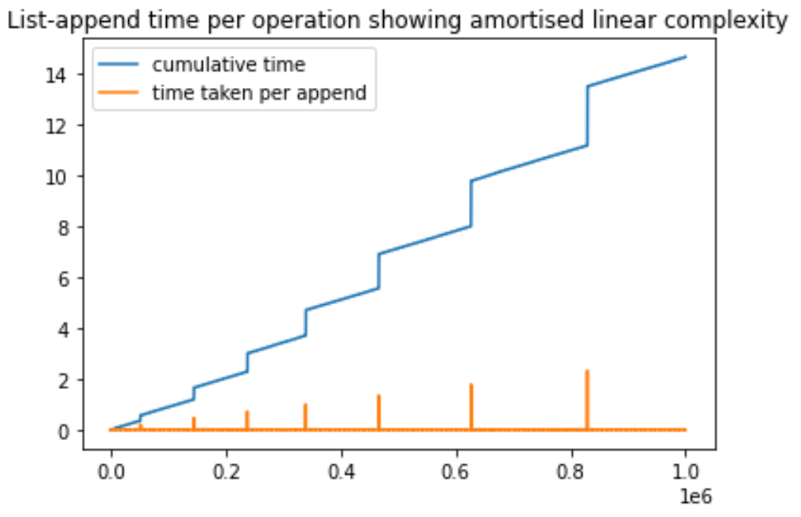

<style TYPE="text/css">
code.has-jax {font: inherit; font-size: 100%; background: inherit; border: inherit;}
</style>
<script type="text/x-mathjax-config">
MathJax.Hub.Config({
    tex2jax: {
        inlineMath: [['$','$'], ['\\(','\\)']],
        skipTags: ['script', 'noscript', 'style', 'textarea', 'pre'] // removed 'code' entry
    }
});
MathJax.Hub.Queue(function() {
    var all = MathJax.Hub.getAllJax(), i;
    for(i = 0; i < all.length; i += 1) {
        all[i].SourceElement().parentNode.className += ' has-jax';
    }
});
</script>
<script type="text/javascript" src="https://cdnjs.cloudflare.com/ajax/libs/mathjax/2.7.4/MathJax.js?config=TeX-AMS_HTML-full"></script>


# 4. ArrayList and Binary Search

## Java ArrayList Methods
> `java.util.ArrayList`

- `add(object)`: adds a new element to the end
- `add(index, object)`: inserts a new element at the specified index
- `set(index, object)`: replaces an existing element at the specified index with the new element
- `get(index)`: returns the element at the specified index
- `remove(index)`: deletes the element at the specified index
- `size()`: returns the number of elements


## Java ArrayList

### Example

```Java
// Initialize with initial length of 0
List<Integer> numbers = new ArrayList<Integer>(0);

// Add numbers by calling add
for (int i = 0; i < 10; i++) numbers.add(i);
System.out.println(numbers);

// Delete numbers by calling remove
for (int i = numbers.size() – 1; i >= 0; i--) {
    if (numbers.get(i) % 2 == 0) numbers.remove(i);
}
System.out.println(numbers);
```

### Characteristics
- ArrayList in Java is created *by default* with a capacity of $10$
    - Can be initialized with a capacity of $0$

- ArrayList will **expand** when `add()` is called, but **DOES NOT shrink** when `remove()`
    - Manually invoke `trimToSize()` method to free up the memory by shrinking size to the number of elements to avoid any memory issue


### Dynamically Change Length
- ArrayList used to implement the **Doubling-up Policy**
- In Java 6: $$(\text{oldCapacity} * 3) / 2 + 1$$
    - Note that for corner cases where `oldCapacity` takes value of $\{0, 1\}$, add $1$ to ensure that there is always at least some increase

    ```Java
    /**
     * Appends the specified element to the end of this list.
     * @param e element to be appended to this list
     * @return <tt>true</tt> (as specified by {@link Collection#add})
     */
    public boolean add(E e) {
        ensureCapacity(size + 1); // Increments modCount
        elementData[size++] = e;
        return true;
    }

    /**
     * Increases the capacity of this <tt>ArrayList</tt> instance, if necessary, to ensure that it can hold at least the number of * elements specified by the minimum capacity argument.
     * @param minCapacity the desired minimum capacity
     */
    public void ensureCapacity(int minCapacity) {
        modCount++;
        int oldCapacity = elementData.length;
        if (minCapacity > oldCapacity) {
            int newCapacity = (oldCapacity * 3)/2 + 1;
            if (newCapacity < minCapacity)
                newCapacity = minCapacity;
            elementData = Arrays.copyOf(elementData, newCapacity);
        } 
    }
    ```


## Amortized Analysis

```Java
List<Integer> numbers = new ArrayList<Integer>(4);
```

### Runtime Complexity Analysis of add(E e) Method

> Assuming doubling up the array

|                      | Running Time | # of Elements | Array Length |
|----------------------|--------------|---------------|--------------|
| numbers.add(1)       | 1            | 1             | 4            |
| numbers.add(2)       | 1            | 2             | 4            |
| numbers.add(3)       | 1            | 3             | 4            |
| numbers.add(4)       | 1            | 4             | 4            |
| **numbers.add(5)**   | 5            | 5             | 8            |
| numbers.add(6)       | 1            | 6             | 8            |
| numbers.add(7)       | 1            | 7             | 8            |
| numbers.add(8)       | 1            | 8             | 8            |
| **numbers.add(9)**   | 9            | 9             | 16           |


> Use banker’s (accounting) method to show Amortized Analysis

| Running time | # of elements | Array length | Allocated dollars | Cost | Saved dollars | Balance |
|--------------|---------------|--------------|-------------------|------|---------------|---------|
| 1            | 1             | 4            | 3                 | 1    | 2             | 2       |
| 1            | 2             | 4            | 3                 | 1    | 2             | 4       |
| 1            | 3             | 4            | 3                 | 1    | 2             | 6       |
| 1            | 4             | 4            | 3                 | 1    | 2             | 8       |
| 5            | 5             | 8            | 3                 | 5    |-2             | 6       |
| 1            | 6             | 8            | 3                 | 1    | 2             | 10      |
| 1            | 7             | 8            | 3                 | 1    | 2             | 12      |
| 1            | 8             | 8            | 3                 | 1    | 2             | 12      |
| 9            | 9             | 16           | 3                 | 9    |-6             | 6       |

> Conclude that `add(E e)` method has **amortized constant time** due to the allocated dollars per operation

### Latency Issue of Amortized Constant Time

<!--  -->


## Binary Search
- Prerequisite: **The array should be sorted**.

```Java
public static int binarySearch(int[] data, int key) {
    int l = 0;
    int r = data.length - 1;
    int mid;

    while (true) {
        if (l > r) {
            return -1;
        }

        mid = (l + r)/2; // Avoid overflow issue
        
        if (data[mid] == key) {
            return mid;
        }

        if (data[mid] < key) {
            l = mid + 1;
        } else {
            r = mid - 1;
        }
    }
}
```

### Why NOT `mid = (l + r)/2`

- The **ones' complement** of a binary number is the value obtained by **inverting (flipping) all the bits** in the binary representation of the number.

- The **most significant bit (MSB)**, i.e. the number on the left, is known as the sign bit, which is used to represent whether the number is positive (0) or negative (1).

- The **twos' complement**, which is the negative equivalent of the original binary number, is get by **taking ones' complement** and **adding 1**.

    | Bits | Unsigned value | Signed value (Two's complement) | One's Complement | Two's Complement |
    |------|----------------|---------------------------------|------------------|------------------|
    | 000  | 0              | 0                               | 111              | 000              |
    | 001  | 1              | -1                              | 110              | 111              |
    | 010  | 2              | -2                              | 101              | 110              |
    | 011  | 3              | -3                              | 100              | 101              |
    | 100  | 4              | -4                              | 011              | 100              |
    | 101  | 5              | 3                               | 010              | 011              |
    | 110  | 6              | 2                               | 001              | 010              |
    | 111  | 7              | 1                               | 000              | 001              |

- With $n$ bits, we can represent unsigned numbers of range:
    $$[0, 2^{(n-1)}]$$

- With $n$ bits, we can represent signed numbers of range:
    $$[–2^{(n-1)}, 2^{(n-1)}–1]$$

- Therefore, do not use `mid = (l + r)/2` but use `mid = l + (r - l)/2` to avoid potential integer overflow issue


### Time Complexity of Binary Search

$$ O(\log n) $$

* In general, $\lfloor \log_{2} n \rfloor+ 1$ operations to split an array in half before it is empty.

* The base of logarithm does not significantly impact the complexity class:
    $$c * \log_{10}(x) = \log_2(x) \text{ where } c = \frac{\log (10)}{\log (2)} = 3.3219 $$

* The time complexity of an algorithm with $O(\log n)$ does not grow proportionally with the input size $n$ but only increases by a constant factor.
    $$
    c \cdot \log_2(2 * n) = c \cdot (\log_2 2 + \log_2 n) = c + c \cdot \log_2 n
    $$


## Constants in Big-O Analysis
It is essential to **consider constants** because Big-O notation represents an **upper bound** on the growth rate of an algorithm's complexity.

Consider:
    $$
    T(n) = n \log n
    $$
    $$
    U(n) = 50 n
    $$

- $T(n) = U(n) \text{ if } n = 2^{50}$
- If $n$ is small ($< 2^{50}$) $ \Rightarrow U(n) \text{ grows more slowly than } T(n)$
- If $n$ is large ($> 2^{50}$) $ \Rightarrow T(n) \text{ grows more slowly than } U(n)$
- In the case, **$U(n)$ might be preferred** since $n$ is more likely to be $< 2^{50}$


## Array & ArrayList Summary
1. Random access
2. No holes allowed -> Shifts
3. Immutable length -> Memory/Latency issue


---

[Back to Home](../index.html)
[Next Lecture](./lecture5.html)